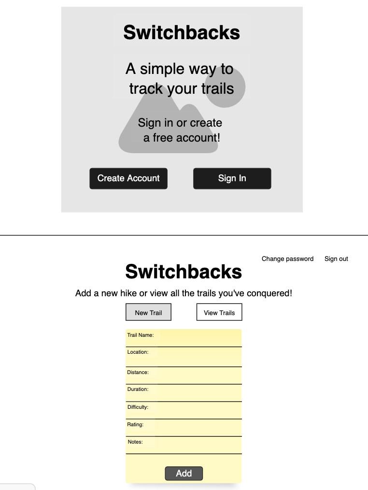

# Application Title: Switchbacks Trail Tracker #

Calling all nature and hiking enthusiasts! This application allows the user to 1) create an account and 2) sign in to 3) keep track of all one's favorite trails, with the ability to create, view, update, and delete one's own hikes.

## Important Links ##

- [Deployed Client] (https://gargygargz.github.io/switchbacks-client)
- [Deployed API] (https://warm-wave-34072.herokuapp.com)

### User Stories ###

- As a user, I want to sign up with email and password
- As a user, I want to to sign in with email and password
- As a user, I want to change password after sign in
- As a user, I want to create, view, update, and delete hikes I've completed
- As a user, I want to sign out

### Technologies Used ###

- Javascript
- jQuery
- HTML/CSS
- Bootstrap
- MongoDB
- Mongoose
- Express

### Wireframe / Entity Relationship Diagram ###

[ERD Link](https://imgur.com/a/iQ1vxq8)